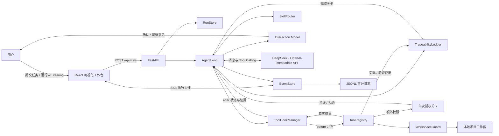
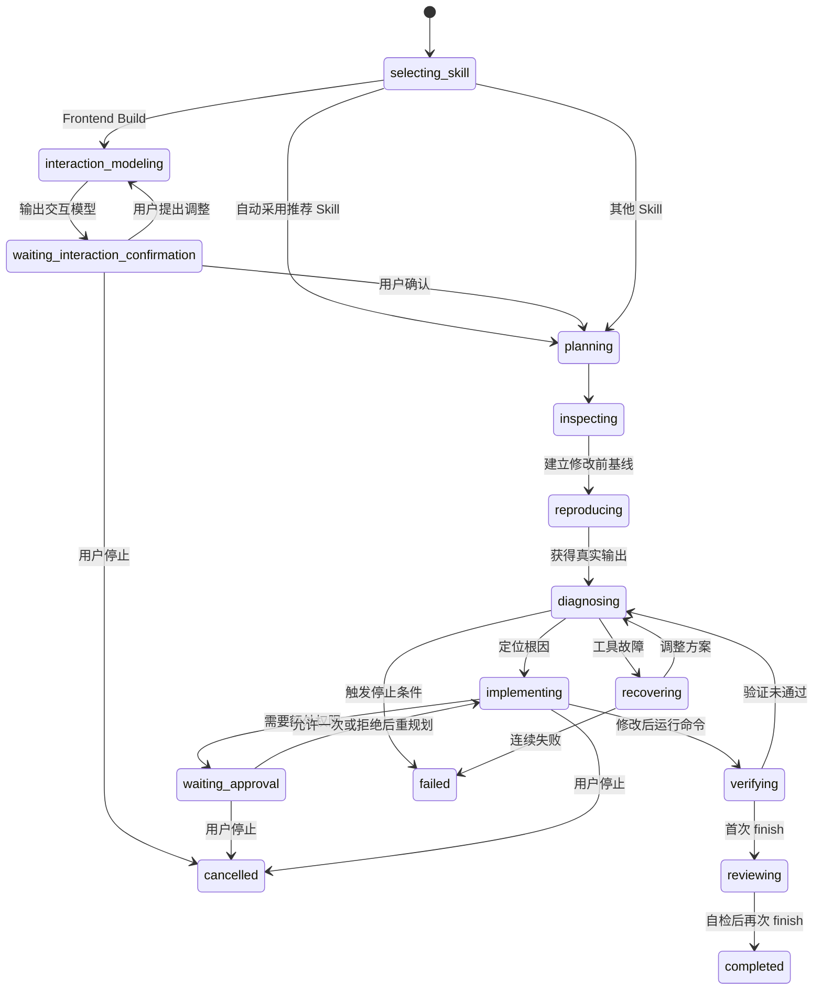

# IntentFlow 工作原理与架构设计

## 1. 项目定位

IntentFlow 是一个从零实现、采用交互优先工作流的本地编程智能体。用户给出任务后，它会在需要时先澄清需求、建立终端用户流程并等待确认，再自主查看项目、读取代码、创建或修改文件、运行测试，并根据真实执行结果继续修复，直到完成任务或触发安全停止条件。

它不是对现成 Agent 产品的界面封装，也没有使用 LangChain、LlamaIndex、OpenAI Agents SDK、AutoGen 等 Agent 框架。对话历史、Skill 路由、工具协议、本地执行、循环控制、错误恢复、上下文裁剪和终止判断均由本项目实现。

最重要的边界是：**模型只负责决定下一步行动，不能直接操作电脑；所有文件和命令操作都必须经过本地宿主程序校验和执行。**

## 2. 总体框架



系统分为四层：

1. **交互层**：React 页面接收任务并展示实时流程、计划、工具调用、Diff 和命令输出。
2. **Agent 核心层**：判断是否需要交互建模、组合 Skill、维护消息历史、调用模型、执行工具循环并判断何时停止。
3. **执行与安全层**：校验路径、工具权限和命令参数，在本地工作区中产生真实副作用。
4. **观测层**：把运行过程建模为事件，通过 SSE 推送前端，同时追加到 JSONL 审计日志。

前端只展示和控制任务，不参与模型决策。当前运行标识、任务和工作区会保存在浏览器会话中；即使页面意外刷新，前端也会从后端恢复已有事件并重新连接尚未结束的事件流。

FlowPet 是前端的多任务协调视图。后端可以让不同工作区的 `AgentLoop` 协程并行运行，前端每 3 秒读取轻量任务摘要，展示计划进度、最近事件与等待状态。用户切换任务时只更换当前观察的 SSE 连接，不会取消原来的后台协程。状态从运行中变为等待确认、完成或失败时，FlowPet 产生应用内提醒。为避免两个 Agent 竞争同一文件，同一个规范化工作区只能存在一个活动任务。

独立的 `/settings` 页面允许用户调整 Agent 的工作方式，而不是改写安全代码。后端在每个任务开始时读取一份不可变配置快照，因此设置变更只作用于之后的新任务，不会让正在执行的循环中途改变规则。

## 3. 一次任务如何运行

### 3.1 创建任务

前端向 `POST /api/runs` 提交两项数据：

- `task`：用户的自然语言需求；
- `workspace`：本次任务允许操作的相对工作区。

后端首先解析工作区并检查它是否位于 `INTENTFLOW_WORKSPACE_ROOT` 内。校验通过后创建 `RunRecord` 和唯一的 `run_id`，再以异步任务启动 `AgentLoop`。前端随后连接 `/api/runs/{run_id}/events` 接收 SSE 事件。

### 3.2 组合 Skill

`SkillRouter` 从 `skills/*/skill.json` 加载所有启用的 Skill。任务可以在前端手动指定能力，也可以使用自动混合路由。目前包含：

| Skill | 适用任务 | 主要特点 |
| --- | --- | --- |
| Bug Fix | 修复错误、失败测试 | 先复现，再定位根因并最小修改 |
| Test Writer | 增加测试覆盖 | 理解现有测试风格后补充用例 |
| Documentation | 编写项目文档 | 从真实项目结构和配置生成说明 |
| Frontend Build | 从需求文档构建前端项目 | 允许创建文件，并要求运行测试验证 |

一个 Skill 由两部分组成：

```text
skills/<name>/
├── skill.json   # 名称、关键词、允许工具、可视化计划
└── prompt.md    # 该类任务的专用执行策略
```

Skill 不直接执行代码。它提供可按需读取的策略提示词、计划模板和最小工具权限，因此新增任务能力通常不需要修改 Agent 主循环。

自动路由分为两层：先统计触发词命中次数形成可解释候选；真实模型模式再仅根据用户任务、候选名称、描述、触发词和得分调用 `select_skills`，返回 1–3 项互补 Skill、整体置信度和简短理由。简单任务只装配一项；同时包含修复、补测试、文档或前端构建等不同目标时才组合多项。路由调用没有文件或命令工具，不能对工作区产生副作用。候选、最终组合、置信度和理由进入事件轨迹。演示模式和模型路由故障会回退到确定性关键词组合。

手动选择优先于自动路由，置信度视为 1.0，并只锁定用户指定的一项。自动组合会合并所选 Skill 的计划与默认工具集合；完整策略由模型通过 `load_skill` 逐项按需读取。宿主安全层继续独立校验每次工具调用，因此组合 Skill 不会绕过工作区隔离、凭据保护或高风险授权。

前端 `/skills` 页面通过以下本地接口管理能力：

- `GET /api/skills`：列出内置与自定义 Skill 及启用状态；
- `POST /api/skills`：创建包含触发词、策略和默认工具集合的自定义 Skill；
- `POST /api/skills/import`：上传并导入 ZIP、JSON 或 Markdown Skill；
- `POST /api/skills/{name}/status`：启用或停用指定 Skill。

导入层在内存中解析文件，不把外部压缩包直接展开到仓库：上传体限制为 1 MB，ZIP 限制文件数量和解压后总大小，并拒绝路径穿越、符号链接与加密成员。解析器只提取 Skill 元数据和提示词，忽略脚本及其它资源，再调用与手工创建相同的校验和持久化入口。

`SkillRouter` 在每个新任务开始时只对启用项评分。配置以原子替换方式写入 `.intentflow/skill-config.json`，重启后仍然生效；至少保留一个启用项，避免 Agent 无策略可选。自定义内容只改变模型策略和默认工具集合，不能改写 WorkspaceGuard、凭据保护或命令风险规则。

### 3.3 Interaction-First 交互确认

Interaction-First 是 Skill 路由之前的独立宿主阶段，并非 Skill，也并非每个问题都会生成流程图。设置启用后，以下任一条件会触发：任务明确要求流程图；空白或仅含需求资料的工作区中出现从零构建完整产品的语义；用户描述简略，但工作区存在需求文档且用户要求实现或继续完成。修复、报错、补测试、解释、字体/样式微调和已有实现上的普通修改会跳过。宿主产生 `interaction_model_decision` 事件记录启用结果和原因，决定不依赖 Skill 选择结果。

通过筛选后，Agent 不会直接进入代码循环，而是先读取工作区根目录中的需求文档，调用模型生成一份结构化产品交互模型：

- 1–8 个终端用户页面及其职责；
- 1–12 条页面流转，边的起止点必须引用真实页面 ID；
- 1–12 条核心状态变化；
- 1–10 条可核对的验收标准。

宿主程序对模型参数进行完整校验，重复页面 ID、无效引用和完全重复的流转边都会退回模型重新生成，然后产生 `interaction_model_created` 事件并把运行状态切换为 `waiting_interaction_confirmation`。前端从入口页面做广度分层，把同阶段分支横向排列，并用轻量重心排序减少交叉；相邻阶段使用曲线连接，返回、循环和跨阶段路径进入外围独立通道。图中只保留编号，完整操作在下方逐条解释；节点说明支持两行，用户可以缩放画布或点击页面聚焦直接流转。内部状态变化不再作为图形展示。此时执行协程等待用户决定，尚未创建 ToolRegistry，也不会执行任何文件写入。用户有两种选择：

1. **符合预期，继续实现**：确认的交互模型写入执行系统消息，成为后续实现和完成前核对的约束；
2. **需要调整**：调整意见和上一版模型一起反馈给模型，生成完整新版本并再次确认，最多迭代 5 版。

这一设计把新产品任务从“需求直接翻译为代码”改成“需求 → 交互模型 → 人工确认 → 实现 → 验证”，同时不打断 Bug Fix、Test Writer 和 Documentation 等已有项目任务。

### 3.4 读取 Agent 配置快照

`AgentSettingsStore` 将用户配置原子写入 `.intentflow/agent-settings.json`。一次任务启动时，`AgentLoop` 只读取一次快照，并把运行模式、质量关卡和预算同时传给提示词、工具注册表与循环终止逻辑。

最大步骤采用“构造器测试覆盖 > 用户已保存设置 > 环境变量首次默认值 > 内置默认值”的优先级。内置默认值为 45；只要用户在设置页保存过配置，该值就不会再被 `.env` 静默覆盖。`run_started` 事件同时记录 `effective_max_steps` 和来源，保证界面显示与循环终止使用的是同一个实际预算。

可调项分为三组：

- **运行模式**：标准模式按 Skill 最小权限运行；安全模式对写入和命令逐次确认；自主模式减少低风险确认；只读模式从宿主层禁止文件写入；
- **质量关卡**：Interaction-First、修改后强制验证、完成前自检；
- **执行预算**：最大步骤、连续失败上限、上下文字符预算、单条命令超时。

运行模式只决定低风险动作是否自动执行。工作区越界、凭据文件、Shell 拼接和危险删除参数仍由 `WorkspaceGuard` 与 `ToolRegistry` 硬编码拒绝，任何页面选项和用户单次授权都不能绕过。

### 3.5 构造模型上下文

Agent 创建初始消息：

- 系统消息：身份、安全规则、所选 Skill 的名称/描述、工作区和完成要求；
- 用户消息：原始任务；
- 工具 Schema：本地开发工具及 `load_skill`。后者只允许读取本轮已选 Skill；Skill 外开发工具会标记为需要用户单次授权。

Skill 使用渐进式加载：路由阶段和常驻上下文只携带较短的元数据，完整 `prompt.md` 保留在宿主侧。模型确定要采用某项专门流程时，调用 `load_skill(skill_name)`，其结果再作为普通工具观察进入上下文。这减少了多 Skill 组合时的固定提示词占用，也让“选择了哪些能力”和“实际读取了哪些能力”都能在事件轨迹中审计。

真实模型模式直接调用 DeepSeek 的 OpenAI-compatible `chat/completions` 接口，并使用模型原生 Tool Calling。Skill 路由与交互建模只有一个合法工具时，会通过 `tool_choice` 强制模型提交对应结构，避免返回普通文本后错误回退。连接失败、请求超时、HTTP 429 和服务端错误使用最多三次指数退避重试；认证、余额、限流与网络故障被转换为不含凭据的用户可读错误。API Key 只放在请求头中，不进入模型消息、事件日志或前端。

没有配置 API Key 时，可以使用确定性的本地演示模型。演示模型仍然经过同一套 ToolRegistry、WorkspaceGuard、事件流和终止逻辑，只是不产生真实模型请求。

### 3.6 观察—行动—反馈循环

Agent 的核心不是一次性生成整个答案，而是反复执行以下闭环：

```text
将任务、历史和工具定义发送给模型
        ↓
模型返回一个或多个 tool_calls
        ↓
解析并校验工具名称与 JSON 参数
        ↓
在本地执行工具
        ↓
把成功结果或错误转换成结构化 observation
        ↓
将 observation 作为 tool 消息加入历史
        ↓
模型依据真实反馈决定下一步
```

简化伪代码如下：

```python
messages = build_initial_context(task, selected_skill)

for step in range(max_steps):
    messages = compact_context_if_needed(messages)
    turn = await model.complete(messages, allowed_tool_schemas)

    if turn 没有工具调用:
        要求模型继续使用工具或调用 finish
        continue

    for call in turn.tool_calls:
        decision = await hooks.before_tool_call(call, runtime_state)
        result = decision.result if decision.blocked else await tool_registry.execute(call.name, call.arguments)
        if result.approval_required:
            decision = await wait_for_user_decision(result)
            result = await execute_once_if_allowed(call, decision)
        effects = await hooks.after_tool_call(call, result, runtime_state)
        emit_events(call, result)
        messages.append(as_tool_observation(result))

        if call.name == "finish" and result.ok:
            complete_run()
            return

stop_safely_when_budget_exhausted()
```

工具失败不会直接使 Agent 崩溃。错误会像正常结果一样写回上下文，模型可以重新读取文件、调整补丁或改用其他方法，这构成了失败恢复能力。测试命令返回非零退出码被视为开发过程中的正常诊断结果，不累计为工具故障；权限校验、参数错误和宿主执行异常才进入连续失败计数。

### 3.7 运行中 Steering

当 `RunRecord` 处于 `running` 状态时，前端可向 `POST /api/runs/{run_id}/steering` 发送一条方向修正。它不创建新的 Run 或 Session Entry，而是先进入当前 Run 的有界队列并产生 `steering_received` 事件。Agent 在下一次调用模型前一次性取出待处理消息，以新的用户消息加入对话上下文，再产生 `steering_applied` 事件。消息若在模型请求或工具执行期间到达，会等待当前动作结束；如果模型正准备调用 `finish`，宿主检测到待处理 Steering 后会暂停完成，在下一轮应用消息，避免方向修正被竞态漏掉。

Steering 消息随当前 Session Entry 追加保存，并纳入结构化上下文压缩。它是最新任务要求，但不是权限凭证：等待 Skill、交互流程或高风险操作确认时，API 会要求用户先使用对应的专门控件；消息也不能绕过 WorkspaceGuard、工具权限、验证、需求证据或 README 交付关卡。

### 3.8 可信工具 Hook 管线

`AgentLoop` 不再直接堆叠所有工具前后处理，而是在每次真实工具调用两侧运行自己实现的 `ToolHookManager`：

```text
模型 tool_call
  → before_tool_call：参数校验 → 重复动作守卫 → 质量前置关卡
  → ToolRegistry：权限、工作区和命令校验 → 本地执行
  → after_tool_call：需求证据收集 → Run 状态与文件/命令记录
  → tool observation 返回模型
```

before Hook 按注册顺序运行并支持短路：参数损坏、同一动作连续三次或修改前缺少观察/失败基线时，后续 Hook 与真实工具都不会执行，而是返回结构化阻止结果。after Hook 共享一次真实 `ToolResult`，只从结果归档事实，不自行伪造工具成功。每个 `tool_finished` 事件都带有 `hook_pipeline`，记录本次 before 决定和执行过的 after Hook；前端详情区将其渲染为 `BEFORE → TOOL → AFTER` 管线。

Hook 与 Skill 是两套不同边界：Hook 只能由宿主代码注册，属于可信执行层；用户创建或导入的 Skill 仍只有提示词、触发词和声明式工具权限，不会加载其中的 Python/JavaScript。这样既获得可扩展性，也避免外部 Skill 在 Agent 进程内执行任意代码。

### 3.9 质量关卡

为了用少量额外轮次换取更高成功率，宿主程序会检查 Agent 是否完成必要证据链：

1. 修改前至少成功列出、读取或搜索过项目；
2. Bug Fix 和 Test Writer 在修改前必须运行现有检查，建立失败基线；
3. 产生文件改动后必须有一次成功的测试或等价验证；
4. 第一次调用 `finish` 不会立即结束，而是进入完成前自检；
5. Agent 至少重新读取一个改动文件或检查 Git Diff 后，第二次 `finish` 才能完成。

未满足关卡时会产生 `quality_checkpoint` 事件和结构化工具反馈，模型据此回到缺失节点，不计入连续失败。

### 3.10 需求追踪与证据关卡

Interaction-First 经用户确认后，宿主会把每条验收标准规范化为 `AC-01`、`AC-02` 等稳定编号，并创建 `TraceabilityLedger`。计划中的诊断、实现、验证与复读节点会携带这些编号；模型调用 `create_file`、`apply_patch`、`run_command` 或审查性 `read_file` 时，可以通过 `requirement_ids` 声明本次动作直接覆盖的验收项。

证据并不由模型口头声明，而是在工具执行之后依据真实结果生成：

- 成功创建或修改文件形成实现证据，并立即使该验收项过去的验证失效；
- 成功或失败的测试、构建、类型检查、Lint 等命令形成验证证据；
- `python --version` 等环境探测不会被误算为需求验证；
- 标记为 `human_review` 的验收项必须通过显式关联的文件复读形成审查证据；
- 只有一个验收项时，宿主允许保守推断关联；存在多个验收项却没有显式编号时，不会把一次宽泛修改冒充为全部需求的实现证据。

每次证据变化都会产生 `traceability_updated` 事件，并把完整快照写入 Run、Session 结构化摘要和最终事件。调用 `finish` 时，宿主先检查所有 `must` 验收项：缺少实现、修改后未重新验证或最近验证失败，都会转换成 `quality_checkpoint` 反馈并让 Agent 继续工作；只有闭环后才进入原有的完成前自检。前端右侧“需求证据”面板展示覆盖率、每项状态、关联文件、验证命令及结果，因此用户能从需求一直追到可复核证据。

## 4. 本地工具系统

所有工具由 `ToolRegistry` 自行定义和执行：

| 工具 | 作用 | 关键约束 |
| --- | --- | --- |
| `list_files` | 查看目录结构 | 跳过依赖、构建产物和凭据文件 |
| `read_file` | 按行读取文本 | 单次最多 400 行，输出可截断 |
| `search_text` | 搜索工作区内容 | 只搜索受支持的文本文件 |
| `create_file` | 创建新文本文件 | 仅新文件、拒绝覆盖、限制类型和大小 |
| `apply_patch` | 局部替换已有文件 | `old_text` 必须唯一匹配并返回 Diff |
| `run_command` | 执行开发命令 | 默认允许列表、额外命令逐次授权、无 Shell、超时、输出截断 |
| `finish` | 提交最终结果 | 明确结束循环并提供总结与验证结果 |

“创建”和“修改”被设计成两个工具：`create_file` 不能覆盖文件，`apply_patch` 又要求旧文本唯一匹配。这样可以降低整文件重写、静默覆盖和基于过期内容修改的风险。

`run_command` 使用参数数组启动子进程，并禁止启动 Shell 解释器，因此管道、重定向和命令拼接不会生效。常见开发命令默认允许；Git 写操作、依赖安装和其他额外命令必须展示完整参数并获得单次授权。

## 5. 状态机与终止条件

一次运行会经过以下主要阶段：



循环不会无限运行，以下任一条件都会终止任务：

- 模型成功调用 `finish`；
- 用户点击停止；
- 达到默认 45 步执行预算，或用户为该轮配置的实际上限；
- 连续三次没有返回工具调用；
- 连续三次工具执行失败；
- 同一工具及相同参数连续出现三次，被判定为无效重复；
- 出现不可恢复的宿主程序异常。

模型不能仅凭自然语言声称“已经完成”。只有显式调用 `finish`，Agent 才会把任务标记为完成。

## 6. 上下文管理

每次模型调用都包含用户目标和最近的工具反馈，但历史不能无限增长。当前实现使用字符预算触发结构化压缩：

- 上下文不超过约 48,000 字符时完整保留；
- 超过预算后始终保留系统约束；
- 生成结构化工作记忆，固定保留原始目标、当前要求、计划的完成/进行中/待办状态；
- 保留已读取文件、已修改文件、成功命令和最近错误；
- 优先保留最近 16 条消息；
- 把结构化记忆插入模型上下文，并产生 `context_compacted` 审计事件；
- 单个工具输出最多保留约 12,000 字符，并保留头尾信息。

压缩只影响下一次模型请求，不删除原始 JSONL 运行轨迹或 Session 节点，因此节省上下文与历史可追溯性彼此独立。

### 6.1 同一工作区的多轮续做

一次模型工具循环结束后，完整的临时消息不会无限追加到下一轮。每个工作区任务属于一个持久化 Session；每轮用户要求是树中的一个 Entry，保存 `parent_id` 与对应 `run_id`。普通“继续完成”把新节点挂到当前节点，用户也可以在前端选择任意已结束的历史节点创建另一子节点，从而形成分支而不改写原路线。

Session 采用 append-only JSONL 存储于 `.intentflow/sessions/`。打开一个节点时，后端沿 `parent_id` 只恢复该分支的祖先路径；新一轮上下文按“原始任务 → 宿主结构化事实摘要 → 当前补充要求”排列。模型必须重新读取当前文件状态，一次性操作授权也不会跨轮继承。这样既支持自然续做和方案试验，也避免把兄弟分支或全部旧工具输出塞进当前上下文。

## 7. 工作区与授权模型

### 7.1 工作区隔离

`WorkspaceGuard` 对每次文件访问重新解析真实路径并检查边界，从而阻止绝对路径、`..` 越界和软链接逃逸。`.env`、`.git`、`.ssh`、`.aws`、证书和密钥文件受到额外保护。

不同项目使用不同工作区。例如：

```text
workspaces/calculator
workspaces/star-catcher
workspaces/2048-game
```

`examples/` 保存只读初始化模板，实际 Agent 只操作被 Git 忽略的 `workspaces/`。内置项目只在根目录首次创建时复制，因此用户移除工作区后不会在后端重启时自动出现。模型在一次运行中只能看到当前选中的项目工作区，既不能跨项目读写，也不能读取 Agent 自身源码。

用户也可以通过工作区选择器创建新的顶层项目目录。后端只接受单层、安全且未被保留的文件夹名称，使用原子目录创建避免覆盖已有项目；新目录保持为空，不复制 Agent 源码或模板。前端创建成功后立即把它选为当前任务工作区，并将所有顶层项目同步到侧边栏。

工作区管理采用可恢复删除：后端仅接受 `workspaces/` 下的完整顶层项目目录，拒绝根目录、嵌套源码目录和任何与活动任务重叠的路径。通过校验后，目录整体移动到 `.intentflow/workspace-trash/`，前端再刷新项目列表；该动作不经过模型，也不扩大 Agent 的文件权限。

### 7.2 分级授权策略

用户点击“开始运行”，表示授权 Agent 在当前工作区中执行该 Skill 允许的低风险操作。读取、局部修改和运行受控测试不逐步弹窗确认，否则会严重打断自主闭环。

当模型确实需要 Skill 外工具、内联脚本、Git 写操作或其他受限命令时，ToolRegistry 返回 `approval_required`，Agent 将状态切换为 `waiting_approval` 并产生授权事件。前端展示工具、完整参数、原因和风险，用户可以允许一次或拒绝。允许只对该次原始动作有效，不会永久提升 Skill 权限；拒绝会成为新的工具反馈，模型可以调整方案。

工作区越界、访问凭据文件以及高风险删除参数仍然直接拒绝，不能通过前端授权绕过。因此当前策略可以概括为：

> 低风险操作自动执行；可审查的额外能力逐次授权；不可接受的安全边界始终拒绝。

这是一层应用级防护，并不等价于容器或操作系统级沙箱，因此工作区仍应只包含可信项目。

## 8. 事件流与可视化

Agent 每发生一次重要变化都会创建结构化事件，例如：

- `run_started`：任务开始；
- `skill_selected`：Skill 选择结果及原因；
- `interaction_context_collected`：已读取产品需求资料；
- `interaction_model_created`：结构化页面流、状态流和验收标准；
- `interaction_confirmation_requested` / `interaction_confirmation_resolved`：产品流程确认、修改意见和最终决定；
- `plan_updated`：计划进度变化；
- `phase_changed`：执行阶段切换；
- `tool_started` / `tool_finished`：工具调用及结果；
- `file_changed`：文件 Diff；
- `quality_checkpoint`：缺失基线、验证或完成前自检时的质量关卡；
- `traceability_initialized` / `traceability_updated`：验收项及其实现、验证、复读证据快照；
- `approval_requested` / `approval_resolved`：授权请求和用户决定；
- `error`：可恢复或终止错误；
- `run_finished`：最终状态和总结。

`EventStore` 同时完成三件事：

1. 在内存中保存当前运行事件；
2. 通过 `asyncio.Condition` 唤醒 SSE 订阅者；
3. 将每个事件追加到 `.intentflow/runs/<run_id>.jsonl`。

后端启动时会重放已有 JSONL，恢复已结束运行及父子对话关系；没有 `run_finished` 的日志会被明确标记为因服务重启中断，并保留已知改动和成功命令，允许用户发起新的关联运行继续。前端只消费事件并渲染，不改变 Agent 决策。这种解耦让可视化故障不会影响核心循环，同时 JSONL 日志可以用于审计、复盘和后续 Replay 功能。

## 9. 前后端接口

| 方法与路径 | 用途 |
| --- | --- |
| `GET /api/health` | 查看后端状态、模型模式和模型名称 |
| `GET /api/workspaces` | 浏览工作区根目录下的安全文件夹 |
| `POST /api/workspaces` | 创建一个空的顶层项目工作区 |
| `DELETE /api/workspaces` | 将一个无活动任务的顶层工作区移入本地回收区 |
| `POST /api/runs` | 创建一次 Agent 运行；可带 Session 与父节点从历史位置续做/分支 |
| `GET /api/runs` | 获取已恢复和当前任务的轻量状态、计划进度和最近事件 |
| `GET /api/runs/{run_id}` | 查询运行状态、已有事件和工作区对话链 |
| `GET /api/sessions/{session_id}` | 获取完整 Session 树及指定活动节点 |
| `GET /api/runs/{run_id}/events` | 通过 SSE 接收实时事件 |
| `POST /api/runs/{run_id}/cancel` | 请求停止运行 |
| `POST /api/runs/{run_id}/skill-selection/{selection_id}` | 确认低置信度路由产生的 Skill 候选 |
| `POST /api/runs/{run_id}/approvals/{approval_id}` | 允许或拒绝一项等待中的单次操作 |
| `GET /api/settings` | 获取 Agent 模式、质量关卡和执行预算 |
| `POST /api/settings` | 校验并保存 Agent 配置，从下一任务生效 |
| `POST /api/settings/reset` | 恢复推荐的标准配置 |
| `GET /api/skills` | 列出 Skill 与启用状态 |
| `POST /api/skills` | 创建自定义 Skill |
| `POST /api/skills/import` | 校验并导入本地 ZIP、JSON 或 Markdown Skill 文件 |
| `POST /api/skills/{name}/status` | 启用或停用 Skill |
| `POST /api/demo/reset` | 安全重置内置演示工作区；运行中的工作区会拒绝重置 |

当前数据采用轻量设计：运行期间的同步对象保存在进程内存中，审计事件和续做关系持久化为 JSONL。后端重启后会从日志重建可查询的 `RunStore`；正在等待或执行的旧运行不会透明恢复线程，而是被安全结束为“已中断”，再由用户在同一工作区续做。

## 10. 技术栈与目录框架

### 技术栈

- 前端：React、TypeScript、Vinext/Vite；
- 后端：Python、FastAPI、Pydantic；
- 模型通信：`httpx` + OpenAI-compatible Chat Completions Tool Calling；
- 实时通信：Server-Sent Events；
- 运行审计：JSON Lines；
- 测试：pytest、Node.js 内置测试工具；
- 配置：环境变量和未入库的 `.env`。

### 主要目录

```text
app/                   前端工作台与界面样式
├── settings/          Agent 设置页面
└── skills/            Skill 管理页面
backend/
├── agent/             Agent 主循环、可信 Hook、计划与上下文裁剪
├── llm/               DeepSeek/OpenAI-compatible 和演示模型客户端
├── skills/            Skill 加载、候选评分与配置管理
├── traceability/      需求编号、证据账本与完成关卡
├── tools/             本地工具定义、参数校验和执行
├── workspace/         工作区路径与凭据保护
├── events/            内存事件通道、SSE 数据源和 JSONL 日志
├── sessions/          树形 Session、分支路径与结构化工作记忆
├── main.py            API 入口与运行调度
├── settings.py        Agent 配置校验、持久化与快照
└── state.py           RunRecord 和 RunStore
skills/                可插拔 Skill 元数据与提示词
examples/              内置项目初始化模板
workspaces/            仅含项目工作副本的本地根目录（不入库）
tests/                 单元测试和完整 Agent 闭环测试
.intentflow/runs/      本地运行审计日志（不入库）
.intentflow/sessions/  本地 Session 树与压缩摘要（不入库）
.intentflow/agent-settings.json  本地 Agent 设置（不入库）
```

## 11. 核心设计点

### 11.1 模型与执行解耦

模型没有文件系统和终端权限，只能提出结构化动作。宿主程序始终掌握最终执行权，这是 Agent 可控性的基础。

### 11.2 Skill 同时约束策略和权限

Skill 不只是附加提示词，还决定本轮可以自动执行的工具集合。模型仍可看到其他工具，但调用时必须经过单次授权。Frontend Build 可以自动创建文件，而 Bug Fix 创建新文件会暂停等待用户决定，这体现了最小权限与任务恢复之间的平衡。

### 11.3 真实反馈驱动，而非一次性生成

测试输出、补丁失败和路径错误都会回到模型上下文。Agent 能根据事实调整行动，而不是生成代码后直接宣称成功。

### 11.4 显式、可解释的停止边界

`finish`、步数预算、失败次数和重复检测共同约束循环，避免模型陷入无限尝试。

### 11.5 决策与可视化解耦

核心循环只产生领域事件；前端负责显示。该设计便于以后替换界面、生成 HTML 报告或实现运行回放，而不用修改 Agent 内核。

## 12. 以 2048 项目为例

`workspaces/2048-game` 初始只保留 `REQUIREMENTS.md`。用户要求按照文档实现项目时，典型流程为：

1. SkillRouter 选择 Frontend Build Skill；
2. Agent 读取需求，生成页面流转、游戏状态机和验收标准；
3. 前端展示交互模型并暂停，用户可以确认或提出修改意见；
4. 用户确认后，Agent 才列出目录、读取需求并规划项目结构与测试策略；
5. 通过 `create_file` 创建页面、样式、游戏逻辑和测试；
6. 执行 `npm test`；
7. 如果测试失败，把错误输出反馈给模型；
8. 模型重新读取相关代码并用 `apply_patch` 修复；
9. 再次运行测试并对照已确认交互模型自检；
10. 验证成功后调用 `finish`，前端展示总结和改动文件。

这条链路同时展示了需求理解、Skill 选择、自主创建、真实执行、失败恢复和结果验证，是本项目最完整的演示场景。

## 13. 当前边界与后续方向

当前版本刻意保持“小而完整”，仍有以下边界：

- RunStore 仍是单进程状态，不支持多后端实例共享；重启可恢复历史，但不能从中断的某个模型调用原地续跑；
- 上下文采用结构化压缩，但尚未建立代码语义索引或模型生成的代码地图；
- 自动路由最多组合三项 Skill；更复杂的依赖关系和 Skill 间冲突消解仍采用主任务提示词优先的简单规则；
- 安全层是应用级校验与人工审批，不是操作系统沙箱；
- Skill 与授权等待状态不会跨后端重启原地恢复，也没有自动超时策略；已确认的交互模型可在关联续做中继承；
- JSONL 已支持审计，但尚未提供独立的 Replay 页面。

可继续扩展的优先级是：授权超时与等待点恢复、Skill 组合、代码地图与事件回放。这些功能都可以沿用现有的工具、事件和状态机接口增加，而不需要推翻核心架构。

## 14. 一句话介绍

> IntentFlow 是一个采用独立 Interaction-First 工作流、支持多 Skill 动态组合、受控本地工具、失败反馈和实时执行可视化的轻量级编程智能体；宿主先判断是否需要产品交互确认，再组合能力并安全执行。
