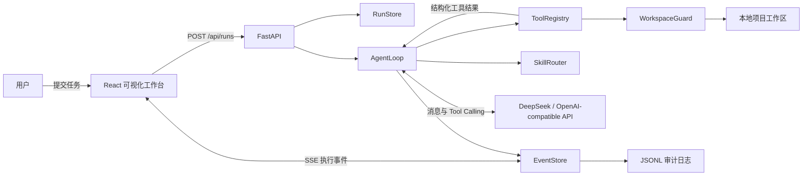
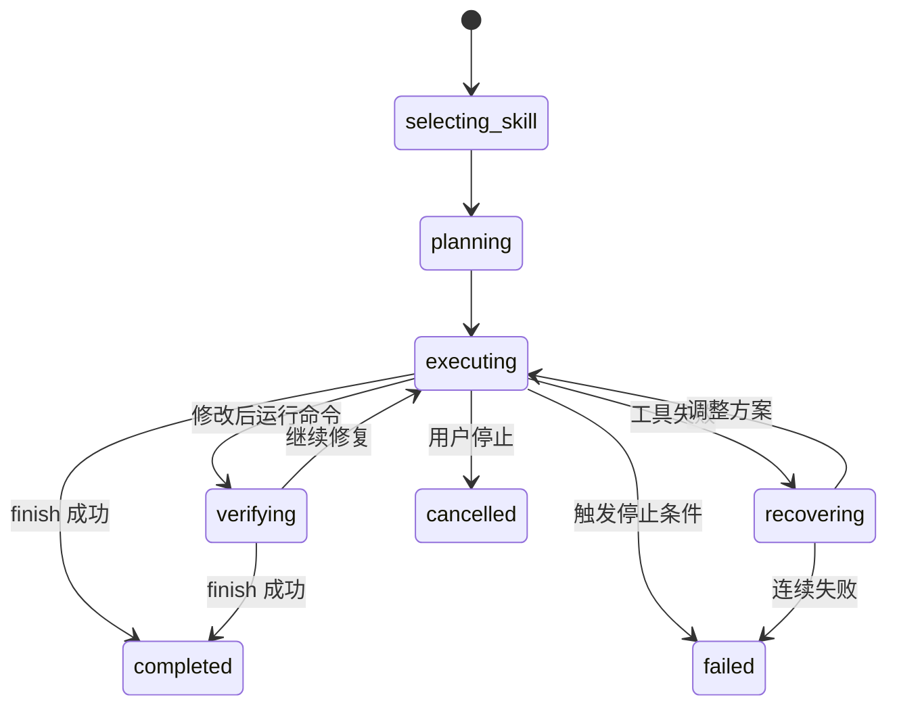

# TraceCoder 工作原理与架构设计

## 1. 项目定位

TraceCoder 是一个从零实现的本地编程智能体。用户给出编程任务后，它能够自主查看项目、读取代码、创建或修改文件、运行测试，并根据真实执行结果继续修复，直到完成任务或触发安全停止条件。

它不是对现成 Agent 产品的界面封装，也没有使用 LangChain、LlamaIndex、OpenAI Agents SDK、AutoGen 等 Agent 框架。对话历史、Skill 路由、工具协议、本地执行、循环控制、错误恢复、上下文裁剪和终止判断均由本项目实现。

最重要的边界是：**模型只负责决定下一步行动，不能直接操作电脑；所有文件和命令操作都必须经过本地宿主程序校验和执行。**

## 2. 总体框架



系统分为四层：

1. **交互层**：React 页面接收任务并展示实时流程、计划、工具调用、Diff 和命令输出。
2. **Agent 核心层**：选择 Skill、维护消息历史、调用模型、执行工具循环并判断何时停止。
3. **执行与安全层**：校验路径、工具权限和命令参数，在本地工作区中产生真实副作用。
4. **观测层**：把运行过程建模为事件，通过 SSE 推送前端，同时追加到 JSONL 审计日志。

前端只展示和控制任务，不参与模型决策。当前运行标识、任务和工作区会保存在浏览器会话中；即使页面意外刷新，前端也会从后端恢复已有事件并重新连接尚未结束的事件流。

## 3. 一次任务如何运行

### 3.1 创建任务

前端向 `POST /api/runs` 提交两项数据：

- `task`：用户的自然语言需求；
- `workspace`：本次任务允许操作的相对工作区。

后端首先解析工作区并检查它是否位于 `TRACE_WORKSPACE_ROOT` 内。校验通过后创建 `RunRecord` 和唯一的 `run_id`，再以异步任务启动 `AgentLoop`。前端随后连接 `/api/runs/{run_id}/events` 接收 SSE 事件。

### 3.2 选择 Skill

`SkillRouter` 从 `skills/*/skill.json` 加载所有 Skill，根据任务中出现的关键词进行可解释评分，选出得分最高的能力包。目前包含：

| Skill | 适用任务 | 主要特点 |
| --- | --- | --- |
| Bug Fix | 修复错误、失败测试 | 先复现，再定位根因并最小修改 |
| Test Writer | 增加测试覆盖 | 理解现有测试风格后补充用例 |
| Documentation | 编写项目文档 | 从真实项目结构和配置生成说明 |
| Frontend Build | 从需求文档构建前端项目 | 允许创建文件，并要求运行测试验证 |

一个 Skill 由两部分组成：

```text
skills/<name>/
├── skill.json   # 名称、关键词、允许工具、可视化计划
└── prompt.md    # 该类任务的专用执行策略
```

Skill 不直接执行代码。它的作用是动态装配本轮任务的策略提示词、计划模板和最小工具权限，因此新增任务能力通常不需要修改 Agent 主循环。

### 3.3 构造模型上下文

Agent 创建初始消息：

- 系统消息：身份、安全规则、所选 Skill 策略、工作区和完成要求；
- 用户消息：原始任务；
- 工具 Schema：当前 Skill 允许调用的工具及其 JSON 参数格式。

真实模型模式直接调用 DeepSeek 的 OpenAI-compatible `chat/completions` 接口，并使用模型原生 Tool Calling。API Key 只放在请求头中，不进入模型消息、事件日志或前端。

没有配置 API Key 时，可以使用确定性的本地演示模型。演示模型仍然经过同一套 ToolRegistry、WorkspaceGuard、事件流和终止逻辑，只是不产生真实模型请求。

### 3.4 观察—行动—反馈循环

Agent 的核心不是一次性生成整个答案，而是反复执行以下闭环：

```text
将任务、历史和工具定义发送给模型
        ↓
模型返回一个或多个 tool_calls
        ↓
解析并校验工具名称与 JSON 参数
        ↓
在本地执行工具
        ↓
把成功结果或错误转换成结构化 observation
        ↓
将 observation 作为 tool 消息加入历史
        ↓
模型依据真实反馈决定下一步
```

简化伪代码如下：

```python
messages = build_initial_context(task, selected_skill)

for step in range(max_steps):
    messages = compact_context_if_needed(messages)
    turn = await model.complete(messages, allowed_tool_schemas)

    if turn 没有工具调用:
        要求模型继续使用工具或调用 finish
        continue

    for call in turn.tool_calls:
        result = await tool_registry.execute(call.name, call.arguments)
        emit_events(call, result)
        messages.append(as_tool_observation(result))

        if call.name == "finish" and result.ok:
            complete_run()
            return

stop_safely_when_budget_exhausted()
```

工具失败不会直接使 Agent 崩溃。错误会像正常结果一样写回上下文，模型可以重新读取文件、调整补丁或改用其他方法，这构成了失败恢复能力。

## 4. 本地工具系统

所有工具由 `ToolRegistry` 自行定义和执行：

| 工具 | 作用 | 关键约束 |
| --- | --- | --- |
| `list_files` | 查看目录结构 | 跳过依赖、构建产物和凭据文件 |
| `read_file` | 按行读取文本 | 单次最多 400 行，输出可截断 |
| `search_text` | 搜索工作区内容 | 只搜索受支持的文本文件 |
| `create_file` | 创建新文本文件 | 仅新文件、拒绝覆盖、限制类型和大小 |
| `apply_patch` | 局部替换已有文件 | `old_text` 必须唯一匹配并返回 Diff |
| `run_command` | 执行开发命令 | 白名单、无 Shell、超时、输出截断 |
| `finish` | 提交最终结果 | 明确结束循环并提供总结与验证结果 |

“创建”和“修改”被设计成两个工具：`create_file` 不能覆盖文件，`apply_patch` 又要求旧文本唯一匹配。这样可以降低整文件重写、静默覆盖和基于过期内容修改的风险。

`run_command` 使用参数数组启动子进程，而不是交给 Shell 解释，因此管道、重定向和命令拼接不会生效。当前只允许常见开发命令；Git 仅开放 `status`、`diff`、`log`、`show` 等只读操作。

## 5. 状态机与终止条件

一次运行会经过以下主要阶段：



循环不会无限运行，以下任一条件都会终止任务：

- 模型成功调用 `finish`；
- 用户点击停止；
- 达到默认 30 步执行预算；
- 连续三次没有返回工具调用；
- 连续三次工具执行失败；
- 同一工具及相同参数连续出现三次，被判定为无效重复；
- 出现不可恢复的宿主程序异常。

模型不能仅凭自然语言声称“已经完成”。只有显式调用 `finish`，Agent 才会把任务标记为完成。

## 6. 上下文管理

每次模型调用都包含用户目标和最近的工具反馈，但历史不能无限增长。当前实现使用字符预算进行轻量裁剪：

- 上下文不超过约 48,000 字符时完整保留；
- 超过预算后始终保留系统消息和原始任务；
- 优先保留最近 16 条消息；
- 插入一条宿主裁剪说明，避免模型误以为历史完整；
- 单个工具输出最多保留约 12,000 字符，并保留头尾信息。

这一策略实现简单、行为可解释，适合当前规模。后续可以升级为基于代码索引、任务摘要和重要性评分的上下文管理。

## 7. 工作区与授权模型

### 7.1 工作区隔离

`WorkspaceGuard` 对每次文件访问重新解析真实路径并检查边界，从而阻止绝对路径、`..` 越界和软链接逃逸。`.env`、`.git`、`.ssh`、`.aws`、证书和密钥文件受到额外保护。

不同项目使用不同工作区。例如：

```text
examples/calculator
examples/star-catcher
examples/2048-game
```

模型在一次运行中只能看到当前选中的工作区，不能跨项目读写。

### 7.2 当前授权策略

用户点击“开始运行”，表示授权 Agent 在当前工作区中执行该 Skill 允许的低风险操作。读取、创建文本文件、局部修改和运行受控测试不逐步弹窗确认，否则会严重打断自主闭环。

当前没有交互式高风险审批窗口。删除文件、安装依赖、联网命令、Git 写操作等高风险能力没有开放，而是直接被工具集合或命令白名单禁止。因此当前策略可以概括为：

> 低风险操作在任务授权范围内自动执行；尚未开放的高风险操作直接拒绝。

如果以后开放高风险工具，合理的扩展是由后端先产生 `approval_required` 事件并暂停运行，前端提供“允许一次”或“拒绝”，再由 Agent 继续执行。

这是一层应用级防护，并不等价于容器或操作系统级沙箱，因此工作区仍应只包含可信项目。

## 8. 事件流与可视化

Agent 每发生一次重要变化都会创建结构化事件，例如：

- `run_started`：任务开始；
- `skill_selected`：Skill 选择结果及原因；
- `plan_updated`：计划进度变化；
- `phase_changed`：执行阶段切换；
- `tool_started` / `tool_finished`：工具调用及结果；
- `file_changed`：文件 Diff；
- `error`：可恢复或终止错误；
- `run_finished`：最终状态和总结。

`EventStore` 同时完成三件事：

1. 在内存中保存当前运行事件；
2. 通过 `asyncio.Condition` 唤醒 SSE 订阅者；
3. 将每个事件追加到 `.tracecoder/runs/<run_id>.jsonl`。

前端只消费事件并渲染，不改变 Agent 决策。这种解耦让可视化故障不会影响核心循环，同时 JSONL 日志可以用于审计、复盘和后续 Replay 功能。

## 9. 前后端接口

| 方法与路径 | 用途 |
| --- | --- |
| `GET /api/health` | 查看后端状态、模型模式和模型名称 |
| `POST /api/runs` | 创建一次 Agent 运行 |
| `GET /api/runs/{run_id}` | 查询运行状态和已有事件 |
| `GET /api/runs/{run_id}/events` | 通过 SSE 接收实时事件 |
| `POST /api/runs/{run_id}/cancel` | 请求停止运行 |
| `POST /api/demo/reset` | 安全重置内置演示工作区；运行中的工作区会拒绝重置 |

当前数据采用轻量设计：运行状态保存在进程内存中，审计事件持久化为 JSONL。后端重启后历史日志仍在，但当前版本不会自动把旧日志恢复到 `RunStore`。

## 10. 技术栈与目录框架

### 技术栈

- 前端：React、TypeScript、Vinext/Vite；
- 后端：Python、FastAPI、Pydantic；
- 模型通信：`httpx` + OpenAI-compatible Chat Completions Tool Calling；
- 实时通信：Server-Sent Events；
- 运行审计：JSON Lines；
- 测试：pytest、Node.js 内置测试工具；
- 配置：环境变量和未入库的 `.env`。

### 主要目录

```text
app/                   前端工作台与界面样式
backend/
├── agent/             Agent 主循环、计划与上下文裁剪
├── llm/               DeepSeek/OpenAI-compatible 和演示模型客户端
├── skills/            Skill 加载与关键词路由
├── tools/             本地工具定义、参数校验和执行
├── workspace/         工作区路径与凭据保护
├── events/            内存事件通道、SSE 数据源和 JSONL 日志
├── main.py            API 入口与运行调度
└── state.py           RunRecord 和 RunStore
skills/                可插拔 Skill 元数据与提示词
examples/              相互隔离、可重复重置的演示工作区
tests/                 单元测试和完整 Agent 闭环测试
.tracecoder/runs/      本地运行审计日志（不入库）
```

## 11. 核心设计点

### 11.1 模型与执行解耦

模型没有文件系统和终端权限，只能提出结构化动作。宿主程序始终掌握最终执行权，这是 Agent 可控性的基础。

### 11.2 Skill 同时约束策略和权限

Skill 不只是附加提示词，还决定本轮允许暴露给模型的工具集合。Frontend Build 可以创建文件，而 Bug Fix 默认只能修改已有文件，这体现了最小权限原则。

### 11.3 真实反馈驱动，而非一次性生成

测试输出、补丁失败和路径错误都会回到模型上下文。Agent 能根据事实调整行动，而不是生成代码后直接宣称成功。

### 11.4 显式、可解释的停止边界

`finish`、步数预算、失败次数和重复检测共同约束循环，避免模型陷入无限尝试。

### 11.5 决策与可视化解耦

核心循环只产生领域事件；前端负责显示。该设计便于以后替换界面、生成 HTML 报告或实现运行回放，而不用修改 Agent 内核。

## 12. 以 2048 项目为例

`examples/2048-game` 初始只保留 `REQUIREMENTS.md`。用户要求按照文档实现项目时，典型流程为：

1. SkillRouter 选择 Frontend Build Skill；
2. Agent 列出目录并读取需求；
3. 模型规划项目结构与测试策略；
4. 通过 `create_file` 创建页面、样式、游戏逻辑和测试；
5. 执行 `npm test`；
6. 如果测试失败，把错误输出反馈给模型；
7. 模型重新读取相关代码并用 `apply_patch` 修复；
8. 再次运行测试；
9. 验证成功后调用 `finish`，前端展示总结和改动文件。

这条链路同时展示了需求理解、Skill 选择、自主创建、真实执行、失败恢复和结果验证，是本项目最完整的演示场景。

## 13. 当前边界与后续方向

当前版本刻意保持“小而完整”，仍有以下边界：

- RunStore 是单进程内存状态，不支持多实例和重启恢复；
- 上下文采用字符裁剪，尚未建立代码语义索引；
- Skill 路由使用关键词评分，复杂组合任务可能只选择一个 Skill；
- 安全层是应用级白名单，不是操作系统沙箱；
- 高风险操作目前直接禁止，尚未实现人工审批和恢复执行；
- JSONL 已支持审计，但尚未提供独立的 Replay 页面。

可继续扩展的优先级是：高风险审批关卡、可恢复运行状态、Skill 组合、代码地图与事件回放。这些功能都可以沿用现有的工具、事件和状态机接口增加，而不需要推翻核心架构。

## 14. 一句话介绍

> TraceCoder 是一个支持可插拔 Skill、受控本地工具、失败反馈、显式终止和实时执行可视化的轻量级编程智能体；模型负责决策，宿主程序负责安全执行。
