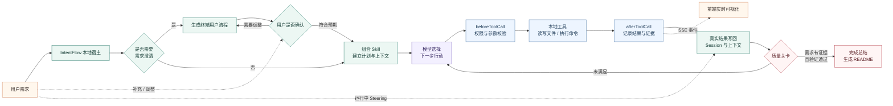

# IntentFlow 两分钟视频展示样例

## 开场：IntentFlow 如何完成任务

开场讲解词（约 25 秒）：

> IntentFlow 的核心是一个由本地宿主控制的任务闭环。面对模糊的新项目，它先生成终端用户流程并等待确认。确认后，模型只负责选择下一步行动，宿主通过 Hook 校验，再调用本地文件和命令工具。真实结果会写回上下文，让模型继续决策；只有质量关卡确认需求有实现证据并且测试通过，任务才允许结束。运行中，用户还可以随时发送 Steering 调整方向。

介绍这张图时，沿着实线从左向右讲即可；虚线表示用户在主流程外的补充输入，以及发送给前端的实时事件。重点强调一句：**模型决定下一步做什么，本地宿主决定能不能做、如何执行，以及是否真的完成。**

## 故事主线

一名不懂开发的学生只有“做一个小组任务协作网页”的模糊想法。IntentFlow 先把日常语言整理成终端用户流程，再请他确认；执行过程中，用户又想起一个使用体验上的要求，通过 Steering 直接补充；最后由质量关卡使用真实测试结果判断任务是否完成。

## 准备

- 工作区选择 `study-board-brief`。
- 开始前确认工作区只有 `REQUIREMENTS.md`。
- 保持 Skill 为“自动组合”。
- 不要在视频中打开 `.env` 或展示 API Key。

## 两分钟逐镜头讲解词

下面的讲解词可以直接边操作边读。正常语速约 1 分 50 秒，保留约 10 秒给页面加载、停顿和剪辑转场。

### 0:00—0:08　项目定位

画面：IntentFlow 首页和项目名称。

讲解：

> 这是我从零实现的编程智能体 IntentFlow，目标是帮助没有编程经验的用户，把模糊想法变成可以使用的软件。

### 0:08—0:32　运行架构

画面：展示上方架构图，鼠标从用户需求依次移动到模型、工具和质量关卡。

讲解：

> React 前端负责交互和 SSE 实时事件，FastAPI 后端运行我自行实现的 AgentLoop。模型只选择下一步行动，不能直接操作电脑；beforeToolCall 校验参数、权限和风险，afterToolCall 根据真实工具结果更新计划、上下文和需求证据。

### 0:32—0:43　用户提出模糊需求

画面：选择 `study-board-brief` 工作区，发送第一次输入。

讲解：

> 现在我模拟一名没有开发经验的学生。他想做一个小组任务网页，但还不清楚具体功能。

### 0:43—0:58　Interaction-First

画面：展示第一版终端用户流程，停留在“需要调整”和“符合预期”两个按钮上。

讲解：

> 系统识别出这是一个模糊的新项目，因此不会马上写代码，而是先整理终端用户流程，让用户确认产品应该怎样运转。

### 0:58—1:10　补充并确认需求

画面：点击“需要调整”，发送第二次输入；快速展示更新后的流程并点击“符合预期，继续实现”。

讲解：

> 用户不需要提供技术方案，只需用日常语言补充成员、任务进度和误删恢复。流程得到确认后，Agent 才开始实现。

### 1:10—1:25　自动执行

画面：加速展示多 Skill 选择、计划推进、读取文件、创建代码和运行命令。

讲解：

> 宿主会自动组合 Skill，并按需加载完整内容。工具结果写入树形 Session 和结构化上下文，使模型能够根据报错继续修复。

### 1:25—1:37　运行中 Steering

画面：任务仍在运行时发送 Steering，展示“收到方向修正”和“方向修正已进入上下文”。

讲解：

> 运行中，用户又想起大家主要使用手机，于是直接发送 Steering。宿主会在下一轮决策前注入这条消息，任务不需要重新开始。

### 1:37—1:49　质量关卡与交付

画面：展示测试通过、需求证据面板和生成的 README，然后快速切到最终网页。

讲解：

> 模型请求结束不代表真的完成。质量关卡还会检查需求对应的实现文件、测试结果和用户说明，只有真实证据满足要求才会结束。

### 1:49—1:57　权限控制补充镜头

画面：插入 `approval-demo` 中的授权弹窗，点击“同意并继续”。

讲解：

> 操作超出当前 Skill 权限时，任务会暂停并展示风险。用户同意后只授权当前一次行动。

### 1:57—2:00　收尾

画面：回到最终网页或 IntentFlow 标题。

讲解：

> IntentFlow 由此连接模糊意图、受控实现和真实验证。

## 连续讲解稿

> 这是我从零实现的编程智能体 IntentFlow，目标是帮助没有编程经验的用户，把模糊想法变成可以使用的软件。
>
> React 前端负责交互和 SSE 实时事件，FastAPI 后端运行我自行实现的 AgentLoop。模型只选择下一步行动，不能直接操作电脑；beforeToolCall 校验参数、权限和风险，afterToolCall 根据真实工具结果更新计划、上下文和需求证据。
>
> 现在我模拟一名没有开发经验的学生。他想做一个小组任务网页，但还不清楚具体功能。系统识别出这是一个模糊的新项目，因此不会马上写代码，而是先整理终端用户流程，让用户确认产品应该怎样运转。
>
> 用户不需要提供技术方案，只需用日常语言补充成员、任务进度和误删恢复。流程得到确认后，Agent 才开始实现。
>
> 宿主会自动组合 Skill，并按需加载完整内容。工具结果写入树形 Session 和结构化上下文，使模型能够根据报错继续修复。
>
> 运行中，用户又想起大家主要使用手机，于是直接发送 Steering。宿主会在下一轮决策前注入这条消息，任务不需要重新开始。
>
> 模型请求结束不代表真的完成。质量关卡还会检查需求对应的实现文件、测试结果和用户说明，只有真实证据满足要求才会结束。
>
> 操作超出当前 Skill 权限时，任务会暂停并展示风险。用户同意后只授权当前一次行动。
>
> IntentFlow 由此连接模糊意图、受控实现和真实验证。

## 第一次输入：模糊需求

> 我想做一个小组任务网页，方便大家知道课程作业还有哪些事情没做。具体应该有哪些页面和功能我还没想清楚，你先帮我整理一下大家会怎么使用，确认后再开始制作。

展示重点：IntentFlow 判断这是一个需要 Interaction-First 的新项目，先输出可视化流程，不创建项目代码。

## 第二次输入：流程调整

第一版流程出现后点击“需要调整”，输入：

> 我们一般是 4—6 个人一起完成课程作业，不需要注册账号。一打开网页，我希望能分别看到还没开始、正在做和已经完成的任务。每项任务要能写名称、负责人、截止时间、重要程度和备注，也要能修改、删除和更换进度。我还想按负责人查看任务，并在误删后马上撤销。页面上最好能看到整体完成情况和最近快到期的任务。

展示重点：第二版流程完整替换第一版，并覆盖看板、任务操作、筛选、撤销和本地数据。随后点击“符合预期，继续实现”。

## 第三次输入：运行中 Steering

等 Agent 完成项目检查并开始创建文件后，在任务仍处于运行状态时输入：

> 我刚想到，我们平时更多是在手机上查看任务。页面不要太挤，按钮和文字大一些，新增任务也尽量简单。你按这个方向继续做吧。

展示时保留以下两个连续事件：

1. “收到方向修正”——说明消息已进入当前运行。
2. “方向修正已进入上下文”——说明下一次模型决策已经读取该消息。

这里可以说明：用户不需要理解技术栈，只需描述新的使用感受。Steering 不会取消任务，也不会创建一轮新任务，而是在下一次模型调用前由宿主程序注入当前上下文，Agent 再自行把“手机上更好用”转化为具体实现调整。

## 结尾验收

依次展示：

1. 测试命令成功。
2. 需求证据面板把验收项关联到实现文件和验证结果。
3. 打开最终网页，新增一条任务并切换状态。
4. 打开 Agent 生成的 `README.md`，说明非开发用户也能照着运行。

结尾讲解：

> IntentFlow 不只是把自然语言直接翻译成代码，而是把模糊意图、用户确认、运行中修正、受控实现和真实验证连接成一个完整闭环。
